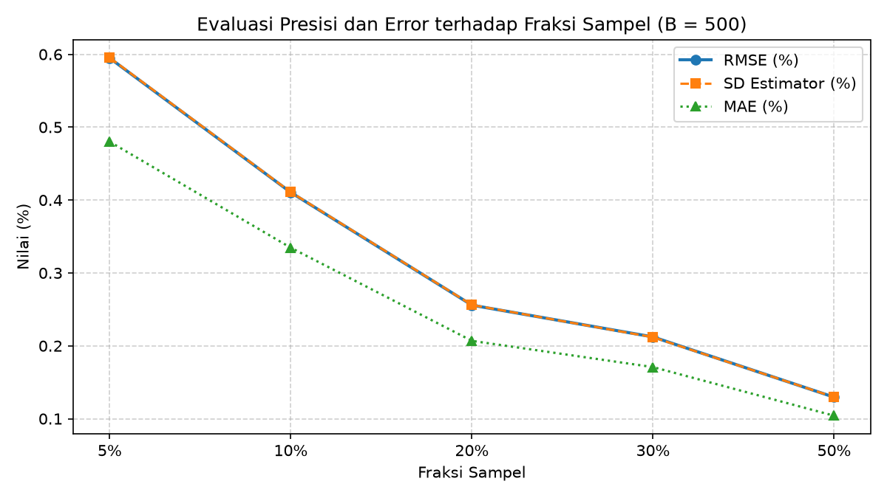

# Simulasi Quick Count Pilpres 2024 Kota Semarang

Dokumentasi ini menyajikan evaluasi pengaruh ukuran sampel terhadap kinerja estimator proporsi suara pada simulasi Quick Count Pilpres 2024 di Kota Semarang (N = 3.276 TPS).

## Data dan Metode

Data yang digunakan adalah hasil rekapitulasi TPS terverifikasi di Kota Semarang dengan total 728.905 suara sah. Pengujian dilakukan menggunakan metode Simple Random Sampling Without Replacement (SRSWOR) dengan 500 kali pengulangan (B = 500) pada lima fraksi sampel representatif: 5%, 10%, 20%, 30%, dan 50%. Parameter acuan populasi yang diestimasi adalah proporsi suara Paslon 02 sebesar 48,303%.

## Hasil Evaluasi Ukuran Sampel

| Sample Fraction | Ukuran Sampel (n) | Mean Estimate | Bias | SD Estimator | MAE | RMSE |
| :--- | :--- | :--- | :--- | :--- | :--- | :--- |
| 5% | 164 | 48,294% | -0,009% | 0,595% | 0,480% | 0,595% |
| 10% | 328 | 48,305% | +0,002% | 0,411% | 0,335% | 0,410% |
| 20% | 655 | 48,303% | +0,000% | 0,256% | 0,207% | 0,256% |
| 30% | 983 | 48,319% | +0,016% | 0,212% | 0,171% | 0,212% |
| 50% | 1638 | 48,305% | +0,002% | 0,130% | 0,104% | 0,130% |

## Grafik Evaluasi

## Interpretasi dan Kesimpulan

Peningkatan ukuran sampel mempertahankan sifat estimator yang tidak berbias (bias mendekati nol), sekaligus menurunkan nilai SD Estimator, MAE, dan RMSE secara signifikan seiring bertambahnya data. Oleh karena itu, fraksi sampel 10% hingga 20% (328–655 TPS) sudah cukup optimal untuk menghasilkan estimasi quick count yang akurat dan stabil dengan galat di bawah 0,5%.
